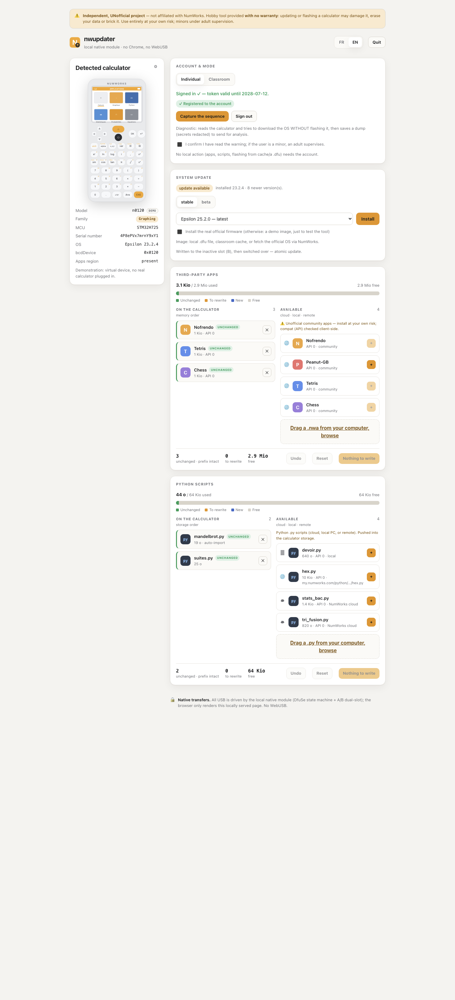
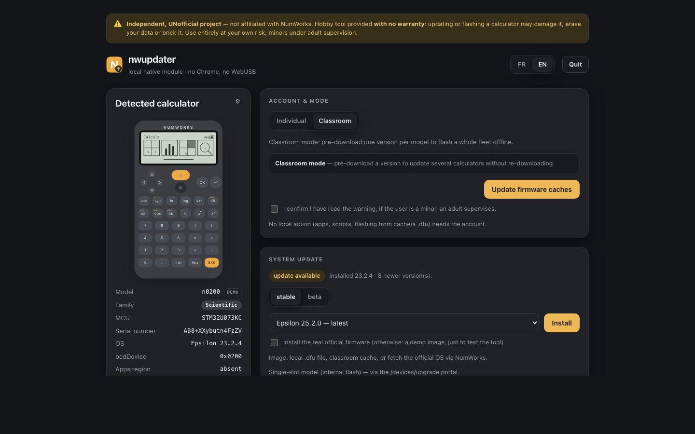

# nwupdater — updater NumWorks headless (sans Chrome/WebUSB)

> ## ⚠️ Projet INDÉPENDANT et NON officiel
> `nwupdater` **n'est pas** une application NumWorks et n'a **aucun lien** avec NumWorks SAS.
> C'est un **outil de hobby**, fourni **SANS AUCUNE GARANTIE**. Mettre à jour ou flasher une
> calculatrice peut **l'endommager, effacer vos données ou la rendre inutilisable
> (« brick »)**. **Utilisation à vos seuls risques.** Voir [`DISCLAIMER.md`](DISCLAIMER.md).

Utilitaire pour mettre à jour les calculatrices **NumWorks** (famille **Graphique N01xx** et
**Scientifique N02xx**) et y installer des applications tierces, **sans passer par Chrome +
WebUSB**. L'architecture : un **cœur headless** natif qui parle USB/DFU, et une **page web
locale** ouverte dans le navigateur système.

> ⚠️ **Contrainte de développement : on ne branche JAMAIS d'USB réel.** Tout se développe et
> se teste contre un **device DFU virtuel** en mémoire. Voir
> [`docs/01-specs/emulators-and-usb-analysis.md`](docs/01-specs/emulators-and-usb-analysis.md).

## Aperçu

> Aperçu de l'interface locale (page web servie en local) — données d'exemple. Interface FR/EN,
> thèmes clair et sombre.

**N0120 (Graphique) — mode individuel.** Les deux ateliers *apps* et *scripts* : contenu de la
calculatrice (ordre mémoire) face aux éléments **disponibles**, agrégés depuis 3 sources — **cloud
NumWorks / fichiers locaux / dépôts distants** (Nwagyu pour les `.nwa`, scripts Python publics
`my.numworks.com/python/…`). Le **plan d'écriture** ne réécrit que la portion de mémoire qui change.



**N0200 (Scientifique) — mode classe.** Pas de flash QSPI ni de Python : les ateliers *apps* et
*scripts* sont **masqués automatiquement** selon le matériel détecté ; ne restent que la mise à jour
système et la gestion de parc (pré-téléchargement des caches firmware, une version par modèle).



## État

| Lot | Sujet | État |
|-----|-------|------|
| 1 | Specs OS/USB-DFU + outillage (device virtuel, client DFU, identité) | ✅ |
| 2 | Catalogue de mises à jour (`firmwares.json`) | ✅ |
| 3 | Transfert + installation (slot A/B, vérif) | ✅ |
| 4 | Applications tierces (`.nwa`) | ✅ |
| 5 | Packaging UI (page web locale) | ✅ |
| 6 | Authentification + téléchargement du vrai firmware officiel | ✅ |

## 🤝 Complément, pas concurrent

`nwupdater` ne cherche pas à remplacer l'outil officiel NumWorks : il couvre les cas qu'il ne
sert pas aujourd'hui (navigateurs sans WebUSB, postes scolaires verrouillés, usage hors-ligne) et
s'appuie sur les **canaux officiels** — le firmware vient du serveur NumWorks, sous le compte de
l'utilisateur. Le projet est ouvert (MIT) : **nous serions ravis de contribuer en amont ou de
transférer tout ou partie de l'outil à NumWorks** si cela sert leurs utilisateurs. La porte est
ouverte → [`SECURITY.md`](SECURITY.md).

## 🎓 Pour les enseignants

- **Équité d'accès** : fonctionne là où l'updater web ne passe pas — Chromebooks et postes
  scolaires sans WebUSB, navigateurs bridés, réseaux filtrés, salles hors-ligne.
- **Mode classe** : pré-télécharger une version une fois, puis flasher tout un parc sans
  re-télécharger.
- **Anti-obsolescence / droit à la réparation** : prolonge la vie d'un parc de calculatrices
  existant.
- **Supervision** : tout flashage par un mineur se fait sous la responsabilité d'un adulte
  (attestation demandée dans l'outil, cf. [`DISCLAIMER.md`](DISCLAIMER.md)).

Base de connaissance complète : [`docs/`](docs/README.md). **Aucun USB réel dans les tests.**

### Téléchargement du firmware officiel (Lot 6)

Les binaires officiels sont servis par `my.numworks.com/firmwares/{modèle}/{stable|beta}.dfu`
**derrière authentification** (401 en anonyme). Pas d'OAuth côté NumWorks : on adopte un
modèle **« bring-your-own-token »** (façon *Mi Unlock*). On ne conserve **que** le cookie
`remember_user_token` (jeton signé, valable ~3 ans), **jamais** le mot de passe.

```bash
# Option A — coller le jeton (le mot de passe ne touche jamais l'outil) :
#   se connecter sur my.numworks.com (cocher « Se souvenir de moi »), puis copier
#   le cookie remember_user_token (DevTools → Application → Cookies).
nwupdater login                       # invite à coller le jeton
nwupdater login --token '<valeur>'    # ou en une ligne

# Option B — login intégré (mot de passe demandé sans écho, jamais stocké) :
nwupdater login --email moi@example.com

nwupdater login --status              # état du jeton (validité)
nwupdater login --logout              # oublier le jeton

# Puis télécharger + flasher le vrai firmware (démo : contre le device virtuel) :
nwupdater install --virtual n0110 --download --channel stable
nwupdater preload n0200 --download    # mode classe : cache le .dfu officiel
```

## Démarrage

```bash
# Aucune dépendance nécessaire pour la démo virtuelle (pas d'USB).
PYTHONPATH=src python3 -m nwupdater.cli identify --virtual n0110
PYTHONPATH=src python3 -m nwupdater.cli catalog  --virtual n0110 --os-version 16.4.4
PYTHONPATH=src python3 -m nwupdater.cli install  --virtual n0110 --to-version 25.2.0 --boot
PYTHONPATH=src python3 -m nwupdater.cli apps     --virtual n0110 --install Tetris
PYTHONPATH=src python3 -m nwupdater.cli ui       --virtual n0110   # ouvre le navigateur

# Tests + lint (pip install -e ".[dev]")
python3 -m pytest -q
python3 -m ruff check src tests
```

Contre une vraie calculatrice (production uniquement) : `pip install 'nwupdater[usb]'` puis
`nwupdater identify` — le **même** client DFU pilote le device virtuel et le réel.

## Architecture du code

```
src/nwupdater/
  models.py              registre des modèles (familles N01xx/N02xx, cartes mémoire)
  cli.py                 CLI: login | identify | catalog | install | apps | preload | cache | ui
  dfu/                   constants, protocol (client DFU hôte), identity (platforminfo),
                         usbio (acquisition matériel réel, pyusb injecté — prod uniquement)
  formats/               headers (SlotInfo/Kernel/Userland), nwa (AppInfo)
  catalog/               firmware.py (firmwares.json), version.py + snapshot data/
                         auth.py (jeton my.numworks.com), download.py (.dfu officiel + provenance)
  install/               image.py (raw/synthetic/DfuSe), installer.py (slot A/B, vérif)
  apps/                  store.py (agrégateur), installer.py + data/ (catalogue communautaire)
  cache/                 store.py (cache firmware « mode classe » : 1 version, purge 30 j)
  server/                httpd.py (API locale stdlib), session.py, instance.py, web/ (page locale)
  testing/
    virtual_dfu.py       device DFU virtuel Niveau 1 (machine à états + platforminfo)
tests/                   suite bout-en-bout 100 % hors-ligne (host ↔ device virtuel ↔ API locale)
```

Le client DFU (`dfu/protocol.py`) ne dépend pas de pyusb : il parle à tout objet exposant
`ctrl_transfer` + `idVendor/idProduct/bcdDevice`. Le device virtuel et un `usb.core.Device`
réel satisfont ce contrat → la logique testée sur mock est identique en production.

## Licence & responsabilité

MIT (voir [LICENSE](LICENSE)). Projet **indépendant et non officiel**, **sans aucune
garantie** — lisez [`DISCLAIMER.md`](DISCLAIMER.md) avant toute utilisation sur du matériel réel.

- [`GOOD-FAITH-DECLARATION.md`](GOOD-FAITH-DECLARATION.md) — déclaration de bonne foi (FR/EN) :
  pré-requis, non-altération des données, sécurisation du jeton, cadre juridique de l'interopérabilité.
- [`SECURITY.md`](SECURITY.md) — signaler une vulnérabilité ou une objection d'ayant droit.
- [`CONTRIBUTING.md`](CONTRIBUTING.md) — mise en route dev, style, règle « jamais d'USB réel ».
