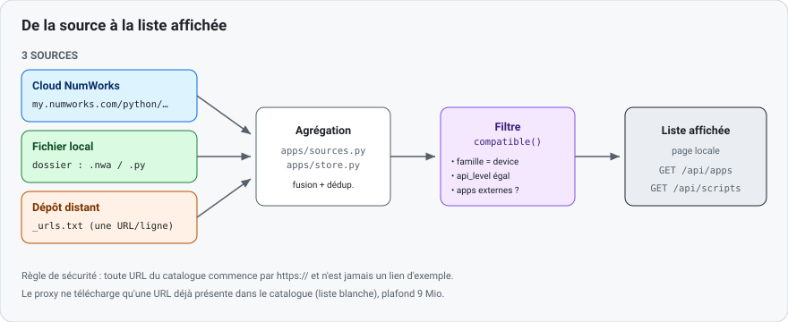

# 1 — Référencer une app ou un script

Objet : rendre une app `.nwa` ou un script Python `.py` visibles dans la page locale.
Vocabulaire commun : [README.md](README.md#vocabulaire).



## Deux chemins

- **Ajout personnel** (recommandé) — déposer le fichier dans un dossier, ou lister son URL.
  Rien à modifier dans le dépôt.
- **Ajout au catalogue livré** — éditer un fichier JSON versionné, pour proposer l'entrée à tous.

### Ajout personnel

```bash
# Apps : déposer des .nwa, ou lister des URL (une par ligne)
mkdir -p ~/.local/share/nwupdater/apps
cp mon-app.nwa ~/.local/share/nwupdater/apps/
printf '%s\n' 'https://exemple.org/mon-app.nwa' >> ~/.local/share/nwupdater/apps/_urls.txt

# Scripts : même principe, extension .py
```

Le dossier est configurable via `NWUPDATER_APPS_DIR` / `NWUPDATER_SCRIPTS_DIR`.
Dans `_urls.txt`, les lignes vides et celles commençant par `#` sont ignorées.

### Ajout au catalogue livré

Éditer [`src/nwupdater/apps/data/community-apps.json`](../../src/nwupdater/apps/data/community-apps.json)
(clé racine `"apps"`).

Champs lus (tout autre champ est ignoré) :

| Champ | Type | Requis | Défaut | Rôle |
|-------|------|--------|--------|------|
| `name` | chaîne | **oui** | — | nom affiché. |
| `url` | chaîne | de fait | `""` | lien direct ; **doit** commencer par `https://`. |
| `version` | chaîne | non | `"?"` | version affichée. |
| `api_level` | entier | non | `0` | doit **égaler** celui du device pour être compatible. |
| `family` | chaîne | non | `"any"` | `"graphique"`, `"scientifique"` ou `"any"`. |
| `size` | entier | non | `0` | taille installée, en octets. |
| `description` | chaîne | non | `""` | texte court. |
| `source` | chaîne | non | `""` | étiquette d'origine (ex. dépôt public). |

Exemple d'entrée réelle (extrait du fichier) :

```json
{"name": "RPN", "version": "2.0.1", "api_level": 0, "family": "graphique", "size": 69587,
 "description": "Reverse Polish Notation calculator", "source": "github.com/1e1/numworks-RPN",
 "url": "https://github.com/1e1/numworks-RPN/releases/download/v2.0.1/rpn-v2.0.1.nwa"}
```

Scripts — [`src/nwupdater/data/community-scripts.json`](../../src/nwupdater/data/community-scripts.json)
(clé racine `"scripts"`, livrée vide). Forme minimale d'une entrée :

```json
{"name": "hello.py", "size": 42, "url": "https://exemple.org/hello.py"}
```

## Règles de validation

- Toute `url` du catalogue livré commence par `https://` et n'est **jamais** un lien d'exemple
  (`example.invalid`). Un test le vérifie.
- Le téléchargement passe par un proxy à **liste blanche** : seule une URL déjà présente dans le
  catalogue est récupérable, en `https://`, plafonnée à 9 Mio.
- Un modèle sans apps externes (N0100, N0200) ne reçoit **aucune** app : c'est une **capacité**
  dérivée du matériel — voir [04-nouveau-device.md](04-nouveau-device.md).

## Tester

```bash
# Valider le catalogue livré + l'agrégation local/distant
python -m pytest tests/test_apps.py tests/test_sources.py tests/test_scripts.py -q

# Vérifier seulement l'absence d'URL factice (rapide)
python -m pytest tests/test_apps.py::test_bundled_catalog_has_no_placeholder_urls -q
```

## Aller plus loin

- [`../04-third-party-apps/app-store-and-nwa.md`](../04-third-party-apps/app-store-and-nwa.md) — format `.nwa`.
- [`../04-third-party-apps/implementation.md`](../04-third-party-apps/implementation.md) — agrégation des sources.
- Code : [`apps/sources.py`](../../src/nwupdater/apps/sources.py), [`apps/store.py`](../../src/nwupdater/apps/store.py), [`apps/proxy.py`](../../src/nwupdater/apps/proxy.py).
