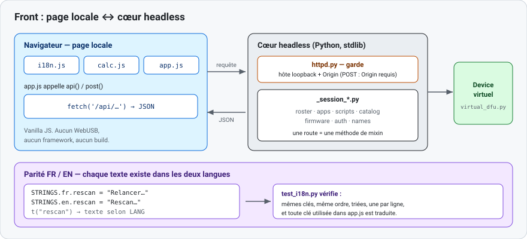

# 2 — Modifier le front

Objet : ajouter ou changer un élément de la page locale (HTML, JavaScript, textes).
Vocabulaire commun : [README.md](README.md#vocabulaire).



## Architecture

- **Vanilla JavaScript.** Aucun framework, aucun bundler, aucune étape de build.
- Trois scripts chargés dans l'ordre : `i18n.js` (textes), `calc.js` (aperçu calculatrice),
  `app.js` (logique).
- Le cœur sert les fichiers de `server/web/` et répond aux appels `fetch('/api/…')`.
- Toute route `/api/` est gardée : hôte **loopback** + `Origin` vérifié ; un `POST` exige un `Origin`.

## Surface d'API

Une route = une méthode d'un mixin `_session_*.py`. Lectures principales (`GET`) :

| Route | Rôle |
|-------|------|
| `/api/identity` | modèle, famille, série, version, **capacités** du device. |
| `/api/catalog` | mises à jour firmware du canal. |
| `/api/apps`, `/api/apps/installed` | apps disponibles / présentes sur le device. |
| `/api/scripts` | scripts disponibles + capacité. |
| `/api/auth` | état de connexion NumWorks. |
| `/api/roster` | parc (mode classe). |

Modifications (`POST`, `Origin` requis) regroupées par famille : `install/*`, `apps/*`,
`scripts/*`, `roster/*`, `cache/*`, `auth/*`, `device/*`. Ajouter une route → l'ajouter dans
[`server/httpd.py`](../../src/nwupdater/server/httpd.py) et une méthode dans le mixin correspondant.

## Ajouter un texte (parité FR/EN)

Le mécanisme est un dictionnaire + une fonction `t()`. Pas d'attribut `data-i18n`.

Ajouter **une ligne dans chaque bloc**, à sa **place alphabétique**, dans
[`server/web/i18n.js`](../../src/nwupdater/server/web/i18n.js) :

```js
// bloc fr
rescan_hint: "Rebrancher, puis cliquer pour relancer la détection.",
// bloc en
rescan_hint: "Reconnect, then click to rescan.",
```

Puis l'utiliser dans `app.js` :

```js
$("rescan-hint").textContent = t("rescan_hint");          // texte simple
toast(t("already_staged", { name: f.name }), true);       // avec paramètre {name}
```

Règles : clé identique et **même ordre** dans les deux blocs, une clé par ligne, blocs triés.
Garder les textes en clair (les rares chaînes contenant du HTML suivent un chemin dédié).

## Recette — ajouter un élément

1. Ajouter la clé dans les **deux** blocs de `i18n.js` (place alphabétique).
2. Ajouter l'élément (avec un `id`) dans `index.html`, ou l'injecter dans un gabarit de `app.js`.
   Échapper toute donnée utilisateur avec `esc()`.
3. Le remplir avec `t("clé")`. Pour un appel réseau, passer par `api()` / `post()`.
4. Tester (voir plus bas).

## Capacités : masquer un onglet

Les onglets *apps* et *scripts* sont masqués selon les **capacités** renvoyées par l'API :

```js
const hasApps = !!(STATE.apps && STATE.apps.hasRegion);   // has_external_apps
const hasPy   = !!(STATE.scripts && STATE.scripts.hasScripts);
$("tab-apps").style.display    = hasApps ? "" : "none";
$("tab-scripts").style.display = hasPy   ? "" : "none";
```

Pour un N0200 (ni apps externes, ni Python), les deux onglets disparaissent. La vérité vient du
matériel — voir [04-nouveau-device.md](04-nouveau-device.md).

## Thème clair / sombre

Variables CSS dans `index.html` (`:root`). Automatique via
`@media (prefers-color-scheme: dark)` ; forçage via `?theme=light|dark` (posé sur
`data-theme`). Toujours lire les couleurs par `var(--…)`, ne pas coder une couleur en dur.

## Tester

```bash
# Parité FR/EN + clés utilisées dans app.js (sans navigateur)
python -m pytest tests/test_i18n.py -q

# Logique et rendu, via navigateur sans tête (optionnel)
python -m pip install -e ".[dev,test-ui]"
playwright install chromium
python -m pytest tests/test_ui_logic.py tests/test_ui_smoke.py -q
```

## Aller plus loin

- [`../05-packaging-ui/implementation.md`](../05-packaging-ui/implementation.md) — page locale, règle de parité.
- Code : [`server/web/`](../../src/nwupdater/server/web/), [`server/httpd.py`](../../src/nwupdater/server/httpd.py).
