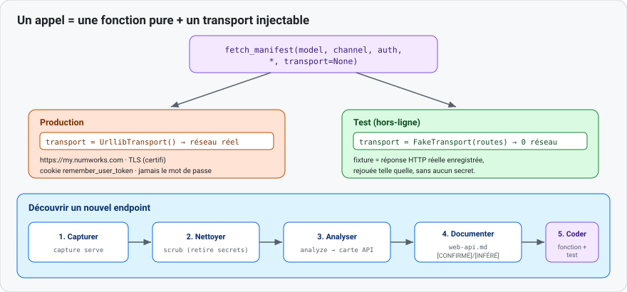

# 3 — Interfacer une API NumWorks

Objet : ajouter ou mettre à jour un appel vers les services en ligne NumWorks.
Vocabulaire commun : [README.md](README.md#vocabulaire).



## Le motif : fonction pure + transport injectable

Chaque appel réseau est une **fonction pure** qui reçoit un **transport** en paramètre. En
production, le transport parle au réseau réel ; en test, un faux transport rejoue une **fixture**.
Aucune écriture disque dans la fonction réseau (l'horodatage, les chemins sont passés en paramètre).

```python
def fetch_manifest(model, channel, auth, *, transport=None):
    tr = transport or UrllibTransport()      # réel par défaut, injectable en test
    resp = tr.open("GET", manifest_url(model, channel),
                   headers={"Cookie": auth.cookie_header()})
    ...
```

## Valider l'entrée avant de construire l'URL

Toute valeur interpolée dans un chemin est validée (anti-traversée / anti-SSRF) :

```python
_MODEL_RE = re.compile(r"^n[0-9a-f]{4}$")     # ex. n0110, n0200
def _check_model(model):
    if not _MODEL_RE.match(model or ""):
        raise ValueError(f"invalid model: {model!r}")
    return model
```

URL firmware : `https://my.numworks.com/firmwares/{model}/{stable|beta}.dfu` (et `.json`).

## Authentification : jeton apporté par l'utilisateur

Les endpoints firmware sont derrière authentification (401 en anonyme), sans OAuth. Le modèle est
**« bring-your-own-token »** : l'utilisateur colle son cookie `remember_user_token`, ou se connecte
une fois.

- **Conservé** (fichier `credentials.json`, `0600`) : le jeton + sa date d'expiration.
- **Jamais conservé** : le mot de passe.
- Sur redirection vers un autre hôte, les en-têtes `Cookie` / `Authorization` sont **retirés**.

## Découvrir un nouvel endpoint

Outil : `nwupdater-capture`. Boucle : capturer → nettoyer → analyser → documenter → coder.

```bash
nwupdater-capture serve       # page locale + userscript ; conduire le scénario sur le site
nwupdater-capture scrub  <capture.json>   # retirer email, série, jetons
nwupdater-capture analyze <capture.json>  # carte des endpoints par scénario
```

Reporter le résultat dans [`../02-update-catalog/web-api.md`](../02-update-catalog/web-api.md),
étiqueté `[CONFIRMÉ]` ou `[INFÉRÉ]`.

## Enregistrer une fixture

Une fixture est une réponse HTTP réelle, **sans secret**, rangée dans `tests/fixtures/`
(ex. `manifest_n0110_stable.json`). Jamais de jeton, jamais de binaire de firmware.

## Écrire le test hors-ligne

Injecter un faux transport qui répond selon `(méthode, url)` :

```python
class FakeTransport:
    def __init__(self, routes): self.routes = routes
    def open(self, method, url, **kw): return self.routes[(method, url)]

resp = fetch_manifest("n0110", "stable", auth,
                      transport=FakeTransport({("GET", URL): Response(200, [], body)}))
assert resp.version == "25.2.0"
```

## Tester

```bash
python -m pytest tests/test_auth_download.py tests/test_proxy.py tests/test_fixtures.py -q
```

## Aller plus loin

- [`../reference/official-webusb-analysis.md`](../reference/official-webusb-analysis.md) — stack web officiel.
- Code : [`catalog/auth.py`](../../src/nwupdater/catalog/auth.py), [`catalog/download.py`](../../src/nwupdater/catalog/download.py), [`apps/proxy.py`](../../src/nwupdater/apps/proxy.py), [`net_capture.py`](../../src/nwupdater/net_capture.py).
