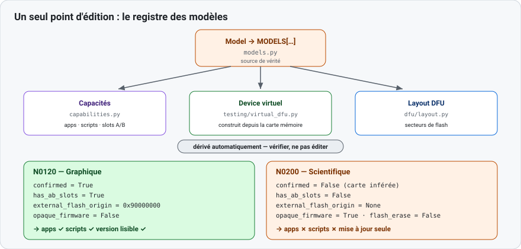

# 4 — Ajouter un device (rétro-ingénierie)

Objet : prendre en charge une nouvelle révision matérielle. Exemples travaillés : N0120
(graphique) et N0200 (scientifique). Vocabulaire commun : [README.md](README.md#vocabulaire).



## Principe : un seul point d'édition

Ajouter un modèle = ajouter une entrée au **registre** `MODELS` de
[`src/nwupdater/models.py`](../../src/nwupdater/models.py). Les **capacités**, le **device virtuel**
et le **layout DFU** se dérivent tout seuls de cette entrée : les vérifier, ne pas les éditer.

## Le modèle et sa carte mémoire

Un modèle = une `MemoryMap` (carte flash/RAM) + un `Model` (identité + drapeaux).

Drapeaux qui distinguent une famille de l'autre :

| Drapeau | Sens |
|---------|------|
| `confirmed` | `False` si la carte mémoire est **inférée** (non confirmée sur matériel). |
| `has_ab_slots` | présence de slots A/B (mise à jour sans risque). |
| `external_flash_origin` | adresse de la flash QSPI externe, ou `None` si absente (→ pas d'apps). |
| `opaque_firmware` | firmware chiffré, sans en-têtes lisibles (→ pas de version, pas de scripts). |
| `flash_erase` | émettre un effacement par page avant écriture, ou non. |

## N0120 vs N0200 (extraits réels)

```python
# Graphique — tous les drapeaux au défaut
0x0120: Model(0x0120, "n0120", "graphique", "STM32H725", _MAP_N0120),

# Scientifique — trois drapeaux explicites
0x0200: Model(
    0x0200, "n0200", "scientifique", "STM32U073KC", _MAP_N0200,
    confirmed=False, opaque_firmware=True, flash_erase=False,
),
```

```python
_MAP_N0120 = MemoryMap(              # QSPI externe → apps possibles
    internal_flash_origin=0x08000000, internal_flash_size=0x80000,
    external_flash_origin=0x90000000, external_flash_size=0x800000,
    sram_origin=0x24000000, sram_size=0x50000,
    has_ab_slots=True, slot_size=0x400000,
)

_MAP_N0200 = MemoryMap(              # pas de QSPI, pas de slots
    internal_flash_origin=0x98000000, internal_flash_size=0x40000,
    external_flash_origin=None, external_flash_size=0,
    sram_origin=0x20000000, sram_size=0xA000,
    has_ab_slots=False,
)
```

Conséquence, **dérivée** sans code supplémentaire :

- **N0120** : version lisible, slots A/B, apps ✓, scripts ✓.
- **N0200** : firmware opaque, un seul bloc, pas d'apps, pas de scripts → **mise à jour seule**.
  C'est ce qui masque les onglets côté front (voir [02-front-end.md](02-front-end.md)).

## Marche à suivre

1. **Relever** : `bcdDevice`, MCU, carte flash/RAM. Marquer `confirmed=False` si inféré.
2. **Ajouter** une `MemoryMap` et un `Model` à `MODELS`. Copier le motif N0120 (graphique) ou
   N0200 (scientifique/opaque).
3. **Nouveau PID USB** seulement : l'ajouter à `KNOWN_PIDS` dans
   [`dfu/constants.py`](../../src/nwupdater/dfu/constants.py).
4. **Vérifier** que capacités, device virtuel et layout se comportent bien — sans les éditer.
   `virtual_calculator("n0xxx")` fonctionne dès que le modèle est au registre.
5. **Piste firmware distincte** seulement (cas N0200) : ajouter
   `catalog/data/firmwares-<modèle>.json` (même forme `[{version, patch_level}]`) et brancher
   `_catalog_for` dans [`server/_session_base.py`](../../src/nwupdater/server/_session_base.py).
6. **Nouveau format firmware** seulement : écrire une spec sous `docs/01-specs/` et, si la version
   vit dans une nouvelle structure, étendre `formats/platform_info.py` / `dfu/identity.py`.
7. **Tester** (voir plus bas).

## Tester

```bash
python -m pytest tests/test_models.py tests/test_capabilities.py \
                 tests/test_n02xx.py tests/test_virtual_dfu.py -q
```

## Aller plus loin

- [`../01-specs/hardware-variants.md`](../01-specs/hardware-variants.md) — familles, MCU, identification USB.
- [`../01-specs/n02xx-firmware-format.md`](../01-specs/n02xx-firmware-format.md) — firmware opaque N02xx.
- Code : [`models.py`](../../src/nwupdater/models.py), [`capabilities.py`](../../src/nwupdater/capabilities.py), [`dfu/identity.py`](../../src/nwupdater/dfu/identity.py), [`testing/virtual_dfu.py`](../../src/nwupdater/testing/virtual_dfu.py).
