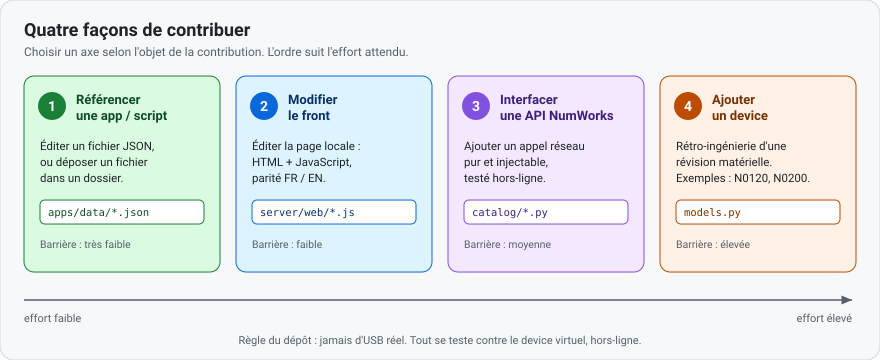

# Contribuer — guide illustré

Quatre façons de contribuer, de la plus simple à la plus exigeante. Une page par façon.
Peu de texte : un schéma, un exemple minimal, une commande de test.



| # | Contribution | Éditer | Page |
|---|--------------|--------|------|
| 1 | Référencer une app ou un script | un fichier JSON | [01-referencer-app-script.md](01-referencer-app-script.md) |
| 2 | Modifier le front | `server/web/*.js` | [02-front-end.md](02-front-end.md) |
| 3 | Interfacer une API NumWorks | `catalog/*.py` | [03-api-numworks.md](03-api-numworks.md) |
| 4 | Ajouter un device | `models.py` | [04-nouveau-device.md](04-nouveau-device.md) |
| 5 | Le linker `.nwa` pur-Python (sans Node) | `formats/nwa_linker.py`, `eadk_runtime.s` | [05-linker-nwa-pur-python.md](05-linker-nwa-pur-python.md) |

Lire d'abord la règle commune, puis le [`CONTRIBUTING.md`](../../CONTRIBUTING.md) racine (mise en
route, style, sécurité).

## Règle commune

- **Jamais d'USB réel.** Tout se développe et se teste contre le **device virtuel**, hors-ligne.
- **Toute modification de comportement s'accompagne d'un test.**
- **Sources génériques.** Ne jamais coder en dur une source tierce ; l'utilisateur fournit ses
  propres dépôts.
- **Aucun secret dans le dépôt.** Ni jeton, ni mot de passe, ni binaire de firmware.

## Mise en route

```bash
python -m pip install -e ".[dev]"     # pytest + ruff + bandit + mypy
python -m pytest -q                   # doit être 100 % vert
python -m ruff check src tests        # lint
```

## Vocabulaire

Termes réutilisés dans toutes les pages. S'y tenir.

| Terme | Sens |
|-------|------|
| **Dépôt** | ce projet. |
| **Cœur headless** | la partie Python qui pilote l'USB/DFU, sans navigateur. |
| **Page locale** | l'interface web servie sur `127.0.0.1` par le cœur. |
| **Device virtuel** | calculatrice simulée en mémoire (`testing/virtual_dfu.py`) ; aucun USB réel. |
| **DFU** | protocole USB de mise à jour du firmware. |
| **Modèle** | une révision matérielle : `n0110`, `n0120`, `n0200`… |
| **Famille** | `graphique` (N01xx) ou `scientifique` (N02xx). |
| **Registre** | le dictionnaire `MODELS` de `models.py` ; source de vérité des modèles. |
| **Capacité** | ce qu'un modèle permet (mise à jour, apps, scripts) ; **dérivée** du registre. |
| **Transport** | objet réseau injectable exposant `open(...)` ; remplacé par un faux en test. |
| **Fixture** | réponse HTTP réelle enregistrée, sans secret, rejouée en test. |
| **Source** | origine d'une app/script : cloud NumWorks, fichier local, ou dépôt distant. |
| **`.nwa`** | fichier d'application tierce. |
| **Parité FR/EN** | chaque texte de la page locale existe dans les deux langues. |

## Références de fond

- [`../01-specs/`](../01-specs/) — specs OS, variantes matérielles, protocole USB/DFU.
- [`../04-third-party-apps/`](../04-third-party-apps/) — format `.nwa`, catalogue d'apps.
- [`../02-update-catalog/web-api.md`](../02-update-catalog/web-api.md) — carte des endpoints NumWorks.
- [`../reference/official-webusb-analysis.md`](../reference/official-webusb-analysis.md) — analyse du stack web officiel.
